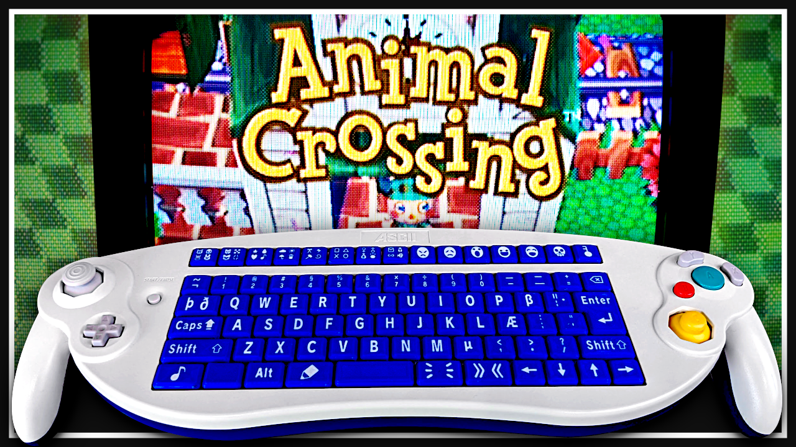
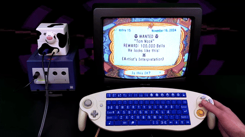
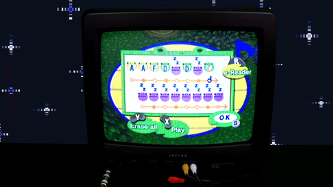
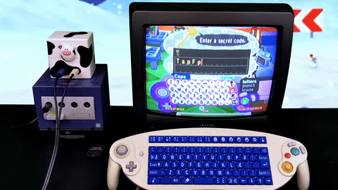
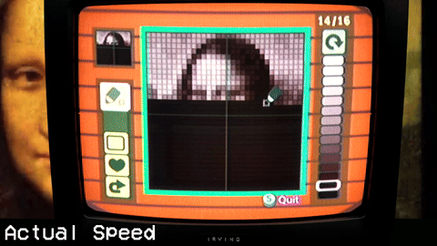
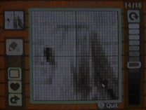
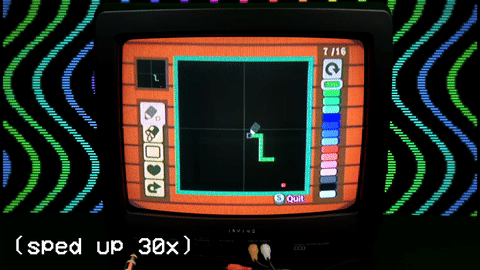
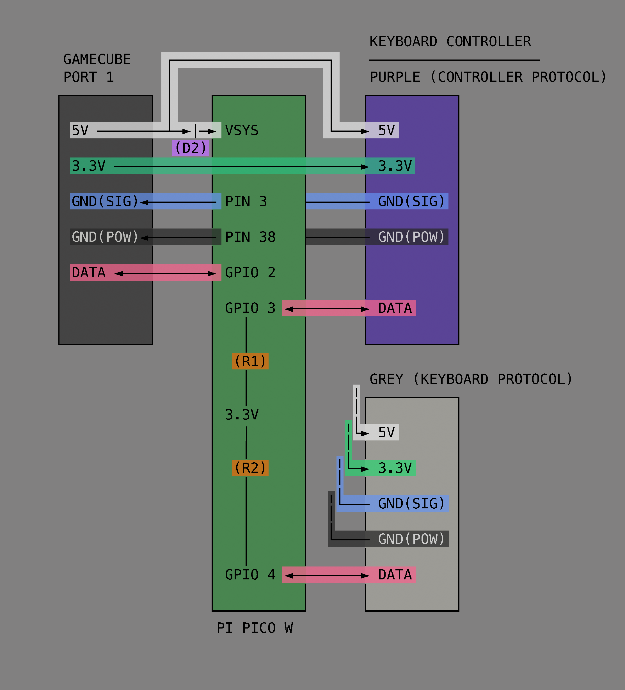

# pico-crossing

><i>What if the GameCube Keyboard Controller worked with Animal Crossing...?</i>

It started out as a "quick, simple project", then quickly turned into seven quick simple projects.

### Demonstration video (on YouTube)

<a href="https://youtu.be/Yw8Alf_lolA" target="_blank">
  
</a>


## Typing at the speed of TAS

Typing in Animal Crossing (GCN) is painfully slow.

Or, at least.. it was. Not anymore.



<code>Pro Gamer WPM (unassisted): TBD</code><br>
<code>Tool-assisted WPM: Also TBD</code>

## Custom Keycaps
Compose digital diary entries in style with this set of 81 custom, 3D printed keycaps that map perfectly to Animal Crossing's in-game character set.

See the separate <a href="https://github.com/hunterirving/pico-crossing-keycaps">pico-crossing-keycaps</a> repository for FreeCAD project files and OBJ exports.

## Infinite Playlist



Cycle through your favorite Town Tunes without having to futz about with e-Reader cards.

## All Items Unlocked



Type the name of (almost) any item, and this little racoon-looking guy will give it to you for free.

Usage: press `Shift` + `Alt` + `🗝️`, then type the name of any compatible item

## Put any Image in the Game



Convert any image to display in Animal Crossing's pattern editor. The script automatically sets up a Python environment and handles all dependencies.

**Basic usage:**
```bash
./convert_image.sh monalisa.jpg
```

See `image_tools/README.md` for advanced usage.

## Put any Video in the Game (if you're patient)



Convert videos to animated sequences in Animal Crossing (requires ffmpeg for video processing).

**Basic usage:**
```bash
./convert_video.sh rickroll.mp4
```

See `image_tools/README.md` for advanced usage.

## A Playable Version of Snake... in Animal Crossing!?
It's more likely than you think.



Usage: press the `S` key while a design (image or video) is being entered.

## Building the Hardware


You'll need:
- a Raspberry Pi Pico (or Pi Pico W)
- two GameCube controller extension cables
- two 1k Ω resistors (1/4W or higher)
- one 1N5817 Schottky diode (protects GameCube from USB 5V backfeeding during flashing/debugging)

Assembly:
1. Cut both extension cables and strip back the outer sleeve to reveal the 5 inner wires. You'll need two female plugs and one male plug.
2. <b>Important:</b> Verify your extension cable pinouts before soldering! The colors in the provided schematic correspond to the "High Quality" labeled cables I used, but colors may vary between manufacturers or even batches.
3. Solder the components to the Pi according to the schematic:
   - Install the Schottky diode between the male plug's 5V line and the Pi's VSYS pin (cathode toward VSYS), then connect the 5V line from the male plug directly to the 5V lines on both of the female plugs.
   - Install pull-up resistors connecting the Pi's 3.3V supply to GPIO 3 and GPIO 4 on the Pi.
   - Connect the 3.3V line from the male plug directly to the 3.3v lines on both of the female plugs (without connecting it to the Pi).
   - Connect GND(POW) from the male plug to PIN 38 on the Pi and the GND(POW) lines on both of the female plugs.
   - Connect GND(SIG) from the male plug to PIN 3 on the Pi and the GND(SIG) lines on both of the female plugs.
   - Connect the DATA line from the male plug to GPIO 2 on the Pi. Connect the DATA lines from the female plugs to GPIO3 and GPIO4 on the Pi.

## Prerequisites

### System Dependencies
- **Python 3** - Required for image/video conversion tools
- **ffmpeg** - Required for video conversion (`brew install ffmpeg` on macOS)
- **picotool** - Required for flashing firmware to Pico
- **Raspberry Pi Pico SDK** - Set up according to official documentation

### Installing picotool

**macOS:**
```bash
brew install picotool
```

**Ubuntu/Debian:**
```bash
sudo apt install picotool
```

## Building the Software

This project includes several build scripts for different workflows:

### Quick Build, Flash, and Monitor
For the fastest development cycle:
```bash
./buildflashmonitor.sh
```
This script runs build → flash → monitor in sequence. Great for testing changes.

### Individual Build Scripts

**Build only:**
```bash
./build.sh
```
Cleans and builds the project, generating the .uf2 firmware file.

**Flash only:**
```bash
./flash.sh
```
Attempts to force the Pico into BOOTSEL mode and flash the firmware (no need to manually hold the BOOTSEL button).

**Monitor serial output:**
```bash
./monitor.sh
```
Opens a serial connection to view debug output from the Pico.

### Manual Flashing Fallback
If the automatic flashing fails:
1. Hold the BOOTSEL button while plugging in your Pico
2. Copy the generated .uf2 file from the `build/` directory to the RPI-RP2 volume

## Licenses and Acknowledgements

This project incorporates code from the following open source repositories:

### From [pico-joybus-comms](https://github.com/JulienBernard3383279/pico-joybus-comms) (GPLv3):
- `joybus.hpp` - GameCube controller communication interface (used directly)
- `joybus.pio` - PIO program for GameCube Joybus protocol (used directly)
- `joybus.cpp` - Joybus communication implementation (adapted with modifications)
- `gcReport.hpp` - GameCube controller report structure (used directly)

### From [retro-pico-switch](https://github.com/DavidPagels/retro-pico-switch) (MIT):
- `controller.pio` - PIO program for reading controller input (used directly)

### From [Raspberry Pi Pico SDK](https://github.com/raspberrypi/pico-sdk) (BSD 3-Clause):
- Core SDK libraries and build system
- `pico_sdk_import.cmake` - SDK integration helper

### Other Sources
The Nook Codes defined in `nookCodes.hpp` are sourced from Nookipedia's <a href="https://docs.google.com/spreadsheets/d/14CdvRHy0Bpm5qkbBYSGRJAytu4UqOKXcatMTBOf3PAU/">Animal Crossing (GCN) Data Spreadsheet</a> (except the code for the `Froggy Chair`, which I generated using Nookipedia's <a href="https://nookipedia.com/wiki/Secret_code/Generator">Secret Code Generator</a>).

### License
This project is licensed under GPLv3, which ensures compatibility with all incorporated dependencies.

## Disclaimer
If you work for Nintendo, <b>Please Understand</b>:<br>No emulation was used in the making of this project, and no game binaries were distributed or modified in the slightest. All footage was captured on unmodified hardware running unmodified, authentic software.